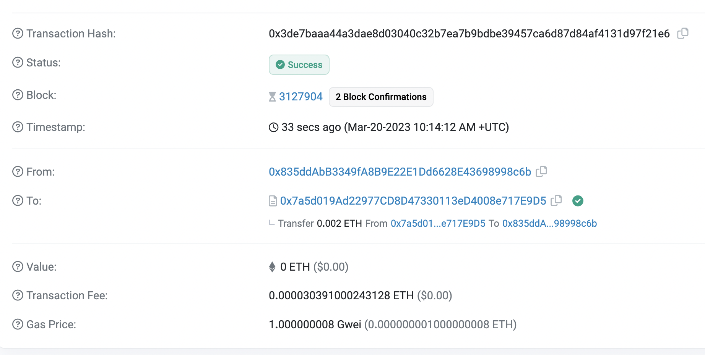

## Bank

要求：

1. 通过metamask向bank合约转账ETH；
2. bank合约记录每个地址转账金额；
3. 编写bank合约withdraw()，实现提取所有的ETH。

### bank合约部署

bank部署地址：https://sepolia.etherscan.io/address/0x7a5d019Ad22977CD8D47330113eD4008e717E9D5

已开源

##### 通过metamask向bank合约转账

### bank合约记录每个地址转账金额

### 编写withdraw()，提取所有余额

1. `withdraw()`用户正常取款；

   

2. `withdrawAllOneAddress()`Owner提取单个地址全部余额：

   

3. `withdrawAll`Owner提取合约全部余额：

​		
