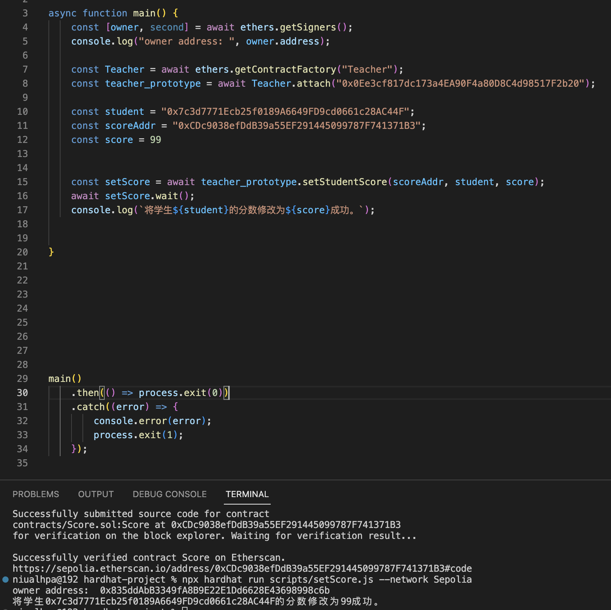
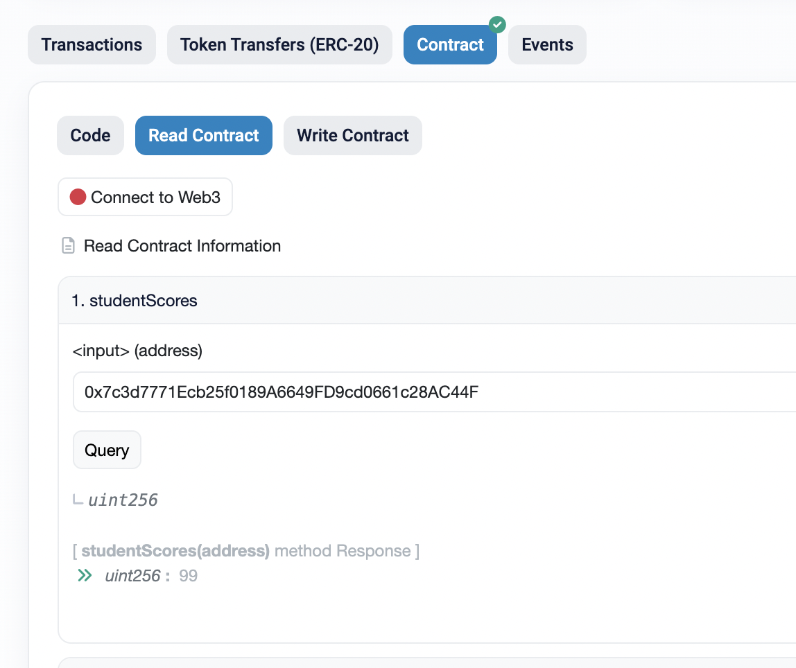
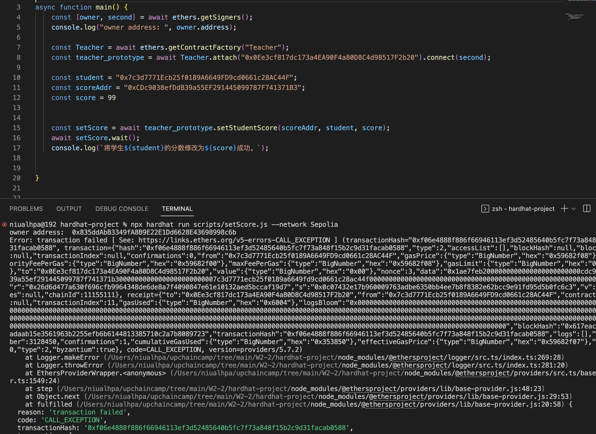
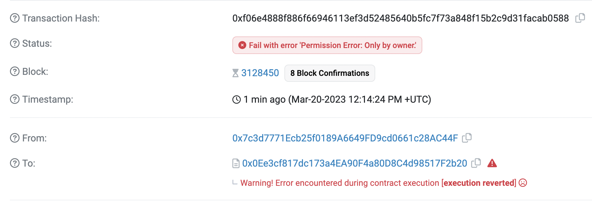

## W2-2练习

1. 编写合约Score，用于记录学生分数；

   * 仅有老师，（用modifier权限控制）可以添加修改学生分数；

   + 分数不可以大于100；

2. 编写合约Teacher作为老师，通过Iscore接口调用修改学生分数；

## 合约部署

teacher contarct：

https://sepolia.etherscan.io/address/0x0Ee3cf817dc173a4EA90F4a80D8C4d98517F2b20

Score contract：

https://sepolia.etherscan.io/address/0xCDc9038efDdB39a55EF291445099787F741371B3

已开源

### 老师修改学生分数

查看学生分数：

若学生自己想修改分数则报错，交易回滚：`only by teacher`

